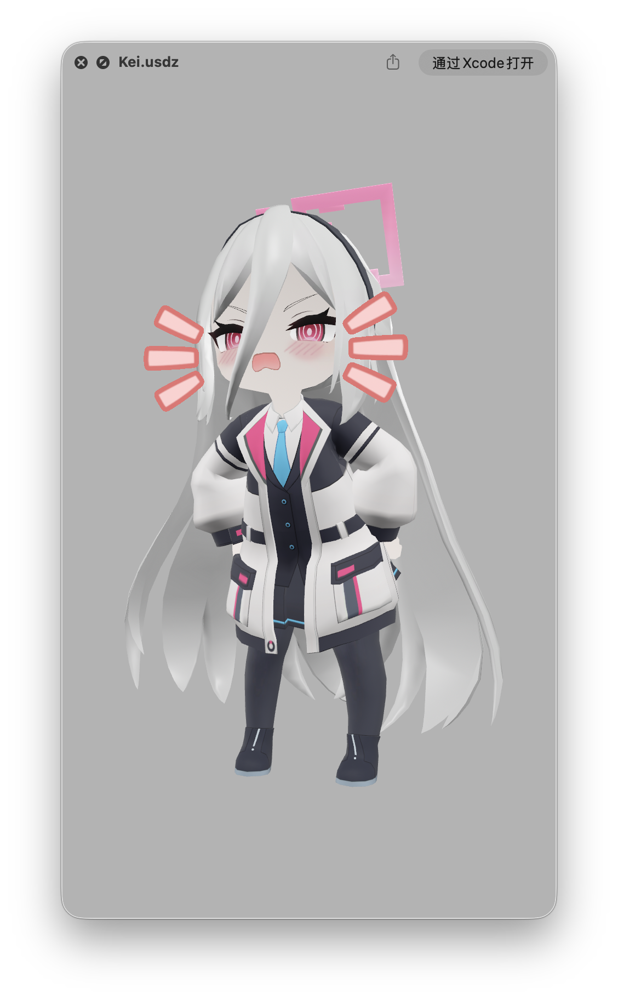

# Kei-BA-USD-Anim

**Blue Archive Kei Character USDZ Model (with Animations)**  
Fan-processed USDZ model of the Kei character with animations, originally extracted from Blue Archive and optimized by me for iOS, iPadOS, and visionOS previews. Some effects were implemented using Reality Composer Pro (the folder includes Reality Composer Pro project files, shared publicly for anyone interested in learning/reference).

Certain features of the USDZ model utilize iOS 26+/iPadOS 26+/visionOS 26+ (or higher versions). Lower system versions may still open the file, but some effects (such as advanced materials, animation transitions, etc.) may not be supported or may display incompletely.

  
*(Model preview screenshot - in macOS Preview)*

### Copyright & Disclaimer
- Model copyright belongs to **NEXON Games & Yostar**.
- Do not use for commercial purposes (including any form of monetization, distribution, sales, etc.).
- When using this model, please comply with the official Blue Archive fan creation guidelines.
- This repository is a personal fan secondary creation project, unofficial. All risks are borne by the user; intended only for learning, appreciation, and testing.